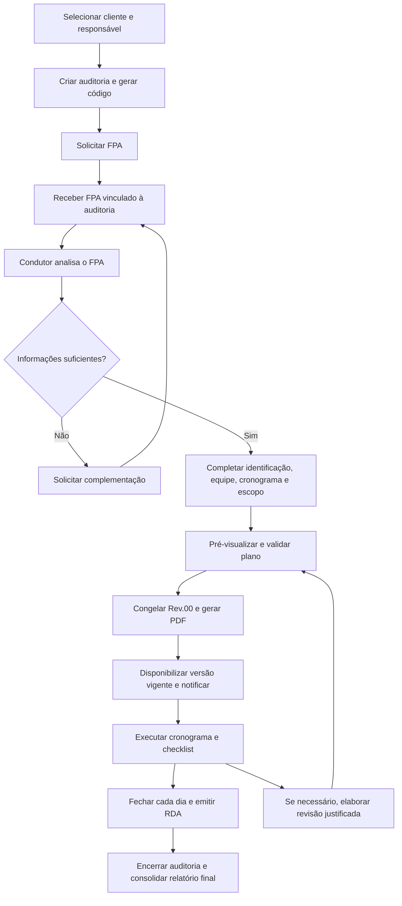

# AUDITA — Planejamento da evolução do Plano de Auditoria

**Produto:** Audita PRO  
**Versão deste planejamento:** 0.1 — 06/10/2026  
**Situação:** documento para validação; implementação futura.

## 1. Objetivo e contexto

Transformar as orientações do arquivo **PLANO DE AUDITORIA.txt** em um fluxo funcional para elaborar, validar, emitir, revisar e executar o Plano de Auditoria no Audita PRO.

A **Audita** é a empresa prestadora de serviços; o **Audita PRO** é seu aplicativo. O fluxo deve atender à operação inicial com um único profissional, permitindo posteriormente a participação de clientes e auditores de apoio. O mesmo profissional pode administrar a plataforma e conduzir uma auditoria, sem necessidade de criar um segundo aprovador fictício.

O plano será a referência da execução: define o que será auditado, onde, quando e por quem. O checklist registra os resultados; o RDA demonstra o realizado em cada dia; o relatório final consolida a auditoria encerrada.

### Base e limites desta análise

- Anexo `PLANO DE AUDITORIA.txt`, lido integralmente.
- Planejamento anterior de Auditorias, documentação da entrega e código local do cronograma/modelos.
- Planejamento do RDA v0.1, utilizado para manter coerência entre os documentos; suas propostas continuam sujeitas à validação.
- Não houve nova consulta ao banco remoto, alteração de código, execução de migrations ou envio de notificações. As instruções do anexo foram tratadas como requisitos para planejamento.

## 2. Fluxo proposto

É possível preparar um rascunho enquanto se aguarda o FPA. A validação final fica bloqueada até que o FPA tenha sido solicitado, recebido e analisado como suficiente pelo condutor.

O cliente deve ser selecionado antes de salvar a auditoria. Isso adapta a ordem ilustrativa do anexo à arquitetura existente e evita auditorias sem organização definida.

## 3. Reutilização da estrutura atual

| Tema | O que existe no código local | Evolução planejada |
|---|---|---|
| Empresas e vínculos | Organizações, unidades, usuários e autorizações | Aproveitar cadastro; verificar/adicionar código permanente do cliente |
| Auditoria | Código, responsável, objetivo, escopo e classificação | Preservar registro; padronizar códigos novos e campos do cabeçalho |
| Critérios | Catálogo de tipos e vínculo principal com um tipo/modelo | Seleção múltipla e composição de auditoria integrada |
| Cronograma | Datas, horários, processos, categorias, requisitos e versões | Local por linha, equipe por atividade, duplicação, ordenação e cópia assistida |
| Período | Datas derivadas do cronograma no fluxo atual | Período informado pelo condutor e validado contra as atividades |
| FPA | Não foi identificado fluxo dedicado nas fontes examinadas | Solicitação, recebimento, análise e histórico vinculados à auditoria |
| Revisões | Versões do plano e movimentos já existem | Congelar também cabeçalho, equipe, escopo, notas e PDF |
| Impressão | Impressão simples do plano no navegador | PDF oficial gerado e preservado por revisão |
| Execução | Condução, avaliações, presenças e encerramento diário | Manter integração e explicitar previsão, execução e trabalho transferido |

Não criar outra tabela de auditorias, empresas, usuários ou planos se a estrutura existente puder ser estendida. A estrutura definitiva será confirmada na inspeção do schema antes da implementação.

## 4. Identificação e códigos

### Cliente

- Gerar automaticamente um código permanente ao cadastrar uma organização cliente, usando formato a validar, por exemplo `CLI-0001`.
- Ser único em toda a operação da Audita, imutável para edição manual e independente do nome/CNPJ.
- O mesmo cliente mantém seu código em todas as auditorias.
- Inativação ou exclusão lógica não libera o código para reutilização.
- Clientes existentes receberão código apenas se ainda não houver equivalente válido, por migração controlada.
- Unidade/local de execução não se torna automaticamente outro cliente. Preservar a estrutura de unidades e seus vínculos.

### Auditoria

- Gerar um código único ao criar a auditoria, por exemplo `AUD-2026-0001`. Os formatos citados são propostas, não valores fixos.
- Nova auditoria do mesmo cliente recebe novo código. Nova revisão do plano da mesma auditoria mantém o código da auditoria.
- Preservar códigos já utilizados em registros ou documentos existentes.
- Impedir alteração manual e reutilização após cancelamento/inativação.
- Geração no servidor, com restrição de unicidade e operação segura para cadastros simultâneos. Não usar apenas a contagem de registros da tela.
- Lacunas na sequência são aceitáveis; não renumerar documentos para eliminá-las.
- Identificadores técnicos internos continuam sendo as chaves dos relacionamentos; o código legível serve à consulta e aos documentos.

Exemplo: `CLI-0001` pode ter `AUD-2026-0001` e `AUD-2026-0042`. A segunda revisão do primeiro plano continua pertencendo a `AUD-2026-0001`, identificada como `Rev.01`.

## 5. Formulário do plano

Todos os campos solicitados são obrigatórios **para validar**, mas o rascunho pode ser salvo incompleto. Campos automáticos precisam existir e estar corretos; não serão digitados novamente pelo condutor.

| Campo | Preenchimento e regra |
|---|---|
| Cliente | Pesquisar por nome e selecionar organização cadastrada; permitir CNPJ/código como apoio de pesquisa |
| Período da auditoria | Data inicial e final informadas pelo condutor; aceitar um ou vários dias, incluindo datas não consecutivas |
| Norma / Critério de Auditoria | Seleção de um ou mais critérios ativos do catálogo; registrar edição/referência quando cadastrada |
| Natureza | Exatamente 1ª parte, 2ª parte ou 3ª parte |
| Localização — endereço | Preencher com endereço do cliente; permitir selecionar unidade/local efetivamente auditado, sem alterar silenciosamente o cadastro da empresa |
| Tipo de Avaliação | Inicial, Certificação, Manutenção, Recertificação, Follow-up, Diagnóstico ou Outra; “Outra” exige descrição |
| Objetivo da Auditoria | Texto manual do condutor |
| Código da Auditoria | Automático e não editável |
| Cliente — código | Automático a partir do cliente selecionado |
| Equipe auditora | Selecionar usuários cadastrados e habilitados para a função; incluir explicitamente o condutor |
| Outros participantes em nome da AUDITA | Texto manual obrigatório ou `N/A`; nomes em texto não criam contas nem concedem acesso |
| Comentários | Texto manual obrigatório ou `N/A` |
| Escopo da Auditoria | Texto manual obrigatório, apresentado após a tabela do cronograma, conforme solicitado |

Nos campos **Outros participantes em nome da AUDITA** e **Comentários**, exibir a orientação: *Caso não se aplique, informar “N/A”.* Usar fonte itálica e cor secundária discreta, mantendo contraste legível. A orientação deve permanecer acessível mesmo após digitar, em vez de depender somente de placeholder.

### Vocabulário consolidado

Este anexo resolve uma dúvida do planejamento do RDA:

- **Natureza:** primeira/segunda/terceira parte.
- **Tipo de avaliação:** Inicial/Certificação/Manutenção/Recertificação/Follow-up/Diagnóstico/Outra.
- **Norma/critério:** referências utilizadas na avaliação, uma ou várias.
- **Modalidade:** presencial/remota/híbrida, quando utilizada no cadastro atual; não substituirá os campos anteriores.

Os documentos futuros devem utilizar o mesmo vocabulário. Valores legados, como uma finalidade textual “Interna”, não serão convertidos automaticamente para “Inicial” ou outra opção sem uma correspondência confiável.

O tipo “Certificação” identifica a finalidade da auditoria, sem significar que a empresa já foi certificada. O plano não contém resultado antecipado.

## 6. Auditoria integrada e checklist

Exemplo: selecionar ISO 14001 e ISO 45001 em uma mesma auditoria.

- Uma organização, um código de auditoria e um plano podem conter vários critérios.
- Associar uma ou mais versões publicadas dos modelos de checklist correspondentes, reutilizando a estrutura atual de checklists vinculados à auditoria.
- Cada requisito conserva a norma/critério e a versão de origem. “4.1 da ISO 14001” e “4.1 da ISO 45001” não são o mesmo registro.
- Uma atividade pode abranger requisitos de vários critérios e processos; as avaliações devem preservar suas identidades.
- Não mesclar requisitos só porque possuem o mesmo número ou texto semelhante.
- Não copiar novamente um requisito a cada duplicação de linha; duplicar o planejamento com referência ao requisito, sem multiplicar indevidamente o escopo.
- Critérios/modelos novos continuam sendo cadastrados pelo Administrador. O condutor seleciona e aplica os modelos autorizados.
- Alterar um modelo publicado não muda auditorias já criadas com a versão anterior.
- Remover um critério depois de iniciada a execução exige revisão de escopo e análise dos registros relacionados; não apagar avaliações/evidências já realizadas.

A seleção múltipla é uma evolução real do fluxo atual, que apresenta um tipo/modelo principal. Não basta trocar o campo visual por uma caixa de seleção múltipla: criação, relacionamentos, listagens, Dashboard, cronograma e documentos precisam compreender todos os critérios.

O conteúdo detalhado e a metodologia do checklist serão refinados em seu planejamento próprio. Não serão preenchidos textos normativos fictícios.

## 7. Cronograma editável

### Colunas visíveis do plano

| Coluna | Regra |
|---|---|
| Localização | Local/unidade/endereço da atividade, sugerido pelo cabeçalho e ajustável por linha |
| Data | Data planejada, dentro do período informado |
| Horário | Início e término; validar duração positiva e ordem dos horários |
| Área / Departamento / Funções / Processos / Aspectos / Atividades | Descrição clara do trabalho, com vínculo estruturado ao processo quando aplicável |
| Auditor | Condutor e/ou auditores de apoio participantes daquela atividade, selecionados da equipe |

No detalhe da linha, manter categoria — abertura, avaliação, reunião, encerramento, intervalo ou outra —, requisitos/critério vinculados e observações pertinentes. Reuniões e intervalos não exigem requisito normativo artificial.

### Ações

- Adicionar, remover, duplicar e reordenar linhas.
- Disponibilizar botões Subir/Descer; arrastar pode ser complementar, nunca a única forma de ordenar.
- Copiar para o próximo horário: sugerir início no término da linha original e preservar duração, permitindo ajuste.
- Copiar para outro dia: permitir escolher a data de destino, inclusive o próximo dia efetivamente planejado. Não assumir que uma auditoria continua no dia corrido seguinte.
- A cópia recebe nova identidade de atividade e não copia execução, evidências, presença ou estado de conclusão.
- Remover linha de rascunho sem histórico operacional é permitido. Após publicação, a retirada é uma alteração controlada, preservando a versão anterior e os registros associados.

### Datas, ordenação e conflitos

- Várias atividades podem ocorrer no mesmo dia, em horários diferentes.
- Intervalos entre datas não geram dias auditados vazios automaticamente.
- Manter ordem manual de apresentação, mas calcular o dia cronológico pela data auditada. A ordenação da tela não pode mudar a identidade de um dia ou de um RDA já emitido.
- Sinalizar linhas fora de ordem cronológica e sobreposição de horários. Não reordenar silenciosamente o que o condutor organizou.
- Sobreposição de atividades de um mesmo auditor gera aviso para revisão; atividades conjuntas devem ser representadas claramente. Equipes diferentes podem ter atividades simultâneas.
- Distinguir o período declarado dos horários/dias efetivamente planejados. Atividade fora do período bloqueia a validação e pede ajuste explícito das datas ou da linha.
- A versão inicial considera atividades dentro de uma mesma data; trabalho atravessando meia-noite deve ser dividido em linhas de datas distintas, até haver tratamento próprio aprovado.

## 8. Equipe, responsabilidade e autorização

| Perfil | Ação proposta |
|---|---|
| Administrador | Cadastrar clientes, tipos/modelos e usuários; criar auditoria/designar responsável; consultar; reatribuir com justificativa |
| Condutor designado — Auditor Líder ou Administrador | Elaborar, revisar, validar, publicar e executar o plano |
| Auditor de apoio | Constará na equipe/atividades e documentos; consulta conforme atribuição, sem conduzir nem editar resultados |
| Participante/auditado | Consulta do plano publicado da organização autorizada; sem edição |

Manter a regra já adotada: outro Administrador que não seja condutor pode reatribuir legitimamente a responsabilidade, mas não assume uma edição operacional sem registro.

A coluna “Auditor” e a nota sobre distribuição da equipe não alteram as permissões automaticamente. Um auditor de apoio pode acompanhar uma atividade designada, porém o registro e a validação permanecem sob responsabilidade do condutor no perfil atual. Permitir que auditores de apoio executem registros autonomamente seria uma alteração de perfis a planejar separadamente.

Selecionar profissionais exige conta ativa e qualificação/aprovação conforme as regras existentes. Não listar clientes como candidatos a condutor. Pessoas citadas em “Outros participantes” permanecem apenas referências nominais até que exista cadastro/vínculo próprio aprovado.

## 9. FPA — preparação necessária ao plano

O FPA pertence à auditoria específica. A mesma empresa pode enviar FPAs diferentes para auditorias diferentes; um formulário antigo não deverá ser considerado recebido para uma nova auditoria automaticamente.

### Fluxo mínimo

| Situação | Registro necessário |
|---|---|
| Não solicitado | Pendência visível; plano pode permanecer em rascunho |
| Solicitado | Data, responsável pela solicitação, destinatário e prazo combinado |
| Recebido | Arquivo/resposta efetivamente recebido, data e responsável pelo recebimento |
| Em análise | Revisão pelo condutor |
| Complementação solicitada | Questões pendentes, destinatário, prazo e histórico |
| Analisado — suficiente para planejar | Confirmação do condutor e versão do FPA utilizada |

**Proposta simples para o piloto:** registrar solicitação e receber o FPA como documento privado anexado à auditoria, permitindo ao condutor registrar um recebimento externo. O status “Recebido” não será apenas uma caixa marcada sem comprovação. O formulário online completo poderá ser planejado posteriormente, sem atrasar o controle mínimo obrigatório.

Se houver upload pelo cliente, essa será uma permissão específica de **envio de FPA**, sujeita à validação, e não autorização geral para editar a auditoria ou enviar evidências. Até aprovar essa expansão, o condutor poderá registrar o arquivo recebido externamente.

O FPA deve contemplar, conforme o material enviado: ramo de atividade, colaboradores, unidades/áreas, processos/atividades, escopo pretendido, requisitos aplicáveis e informações adicionais. Seus campos não serão redesenhados neste plano sem um modelo próprio.

O vínculo ao FPA analisado fará parte do controle da revisão do plano. Se surgir uma nova versão com impacto no escopo ou cronograma, o condutor deverá avaliar e registrar a necessidade de revisar o plano.

Não incluir automaticamente o FPA completo no PDF do plano nem liberá-lo a todos os leitores. A consulta ao FPA pode exigir autorização mais restrita que a consulta ao planejamento publicado.

## 10. Revisão, validação e emissão

### Lista de validação obrigatória

1. Cliente válido selecionado e código do cliente existente.
2. Código da auditoria gerado.
3. Localização preenchida.
4. Período definido, com data inicial não posterior à final.
5. Pelo menos uma norma/critério definido.
6. Natureza e tipo de avaliação definidos; descrição de “Outra” quando necessária.
7. Equipe auditora definida, incluindo condutor habilitado.
8. Outros participantes e comentários preenchidos, aceitando `N/A` nesses campos.
9. Objetivo e escopo preenchidos.
10. Cronograma com pelo menos uma atividade válida.
11. Cada linha com localização, data, início/término, descrição e auditor da equipe.
12. Datas compatíveis com o período e durações válidas.
13. Requisitos selecionados pertencentes aos critérios/modelos da auditoria e distribuídos conforme o escopo previsto.
14. FPA solicitado, recebido e analisado como suficiente.
15. Ausência de conflito de edição: a versão revisada ainda é a versão atual.

O sistema mostrará os campos pendentes com atalhos para corrigi-los, preservando o preenchimento. Avisos de sobreposição serão distintos dos erros que impedem validação.

### Interface proposta

Na aba Auditorias, abrir a auditoria e acessar **Plano de Auditoria** com etapas:

**Identificação e FPA → Equipe → Cronograma → Escopo e comentários → Prévia e validação**.

Na etapa final, conferir o documento, as notas institucionais e a lista de inconsistências. A ação **Validar Plano** confirma a aprovação do condutor e inicia a geração do PDF daquela revisão.

### Estados sem ambiguidade

- **Rascunho:** editável, incompleto permitido, não disponibilizado como plano oficial ao cliente.
- **Validado — PDF em geração:** conteúdo congelado; preparação técnica do arquivo.
- **Publicado — Rev.00:** versão oficial disponível com PDF íntegro.
- **Revisão em elaboração:** nova proposta; a versão publicada anterior continua vigente.
- **Substituído:** versão anterior preservada, com identificação da sucessora.

Falha de PDF será exibida como erro de processamento, com possibilidade de tentar novamente sobre o mesmo conteúdo. Não mostrar link de download inexistente nem avisar que o plano foi publicado antes de o arquivo estar disponível. Duplo clique não cria duas revisões.

Proposta: permitir iniciar a execução depois da primeira publicação. Uma falha técnica na geração não autoriza usar rascunho como plano oficial. Em revisões, a versão anterior permanece vigente até a nova publicação, e o usuário é informado disso.

## 11. Revisões e preservação histórica

- Primeira emissão: `Rev.00`; alteração posterior: `Rev.01` e seguintes.
- Pode-se manter a contagem técnica interna existente e apresentar a revisão documental iniciando em zero.
- Toda nova revisão exige motivo, autoria e data/hora.
- Congelar cabeçalho, cliente/código/CNPJ, endereço, período, critérios/edições, equipe, cronograma, objetivo, escopo, comentários, notas institucionais e versão do FPA de referência.
- Preservar PDFs anteriores; não regenerá-los com dados atuais do cadastro.
- Alterar nome/endereço do cliente ou desativar auditor não reescreve documento antigo.
- Rascunhos podem ser descartados; versões emitidas não serão apagadas pela rotina comum.
- Trocar a organização de uma auditoria já publicada não será uma edição simples: preservar seus documentos e iniciar outra auditoria quando necessário.
- A retenção operacional seguirá a diretriz de cinco anos já adotada no projeto; este plano não cria limpeza automática nem modifica o marco de retenção ainda a detalhar.

No sistema, mostrar tabela com revisão, data/hora, responsável, motivo e acesso ao PDF. No PDF, incluir um resumo do controle documental antes da seção final de notas, mantendo a consulta integral do histórico na plataforma.

## 12. Execução e ligação com o RDA

O plano publicado alimenta a agenda. O condutor abre o dia, registra a presença efetiva, acessa as atividades e seus requisitos e preenche o checklist. A equipe planejada não é automaticamente a presença real.

O sistema deve distinguir:

- Plano original publicado.
- Plano vigente no início do dia.
- Revisões e alterações ocorridas durante o dia.
- Horários e resultados reais da execução.

Conclusão antecipada deve registrar a realização real, sem falsificar a previsão original. Trabalho restante transferido conserva a atividade de origem, a parcela já executada, destino, motivo e autor.

Quando houver alteração futura de escopo, norma, equipe ou período, a nova revisão vale para a continuidade autorizada. Atividades concluídas e documentos emitidos conservam sua referência original.

Ao fechar o dia, o RDA compara previsão e execução, identifica atividades realizadas/parciais/reprogramadas/não realizadas e aponta as pendências. Uma mudança posterior no plano não altera a cópia congelada no RDA.

O relatório final referencia o histórico dos planos e os RDAs da auditoria correta. Não deve somar indiscriminadamente contagens diárias que incluem reavaliações do mesmo item.

### Exemplo ilustrativo

Uma auditoria integrada está planejada para 10, 12 e 13 de outubro. Cada data pode conter várias atividades. Se Compras, prevista para o dia 10 às 15h, for transferida para o dia 12 às 9h:

1. O condutor registra o motivo e publica a revisão do cronograma.
2. A previsão original e o movimento permanecem no histórico.
3. O RDA do dia 10 informa a transferência e o motivo.
4. O dia 12 apresenta a demanda recebida e registra sua execução real.
5. O RDA já emitido do dia 10 não muda quando Compras for concluída.

## 13. Disponibilização e notificações

Proposta coerente com o planejamento do RDA: usuários ativos, com cadastro/vínculo aprovado à organização cliente, consultam o plano publicado da própria organização. Profissionais internos da Audita atribuídos à auditoria e o Administrador também consultam conforme suas funções.

- Cliente não edita o plano; rascunhos ficam restritos à operação autorizada.
- Selecionar uma empresa no Meu Perfil não concede acesso até a validação do vínculo.
- Consulta do plano não concede automaticamente acesso ao FPA, a documentos de competência, evidências completas ou outras organizações.
- A versão vigente será a padrão. Versões anteriores estarão em histórico identificado como substituído.
- Proposta: novos vínculos aprovados podem consultar o histórico publicado; inativação revoga novas consultas e downloads.

Reutilizar o sino de notificações para solicitação/recebimento de FPA quando o destinatário estiver no sistema, plano publicado e revisão disponibilizada. Notificações devem apontar à auditoria/revisão correta, sem duplicidade.

Envio de e-mail ao cliente é uma evolução opcional de canal, não uma obrigação de integrar novo provedor neste piloto. A implementação inicial não deverá anunciar e-mail enviado sem integração e confirmação de envio.

## 14. PDF oficial

### Estrutura

1. Cabeçalho: marca da Audita e **PLANO DE AUDITORIA**.
2. Identificação completa e equipe.
3. Cronograma com as cinco colunas solicitadas.
4. Escopo da Auditoria, após a tabela.
5. Controle da revisão, comentários e informações complementares conforme organização visual aprovada.
6. Página final dedicada às **Notas**, com o texto do Anexo A deste planejamento.

Em todas as páginas, rodapé discreto:

> AUDITA | Plano de Auditoria  
> [Código da auditoria] | Rev.00  
> Página X de Y

Cabeçalho consistente, tabelas com títulos repetidos quando atravessarem páginas, nomes legíveis, horários claros e ausência de cortes de texto. Validar o layout da página final para comportar integralmente as notas sem reduzir a fonte a tamanho ilegível; o restante do documento pode ter quantas páginas forem necessárias.

Preservar o texto institucional do anexo nesta versão. Mudanças futuras nas notas exigem controle da versão do modelo documental e não modificam PDFs anteriores.

A logo corporativa da Audita ainda precisa ser confirmada. A imagem fornecida anteriormente é a marca **Audita PRO**. Até confirmação, propor o uso da marca disponível com identificação textual da Audita, sem inventar uma logo empresarial diferente.

O PDF será gerado automaticamente e armazenado de forma privada por revisão. Download de uma revisão deve entregar o arquivo preservado, não uma nova impressão dos dados atuais. Sugestão de nome: `[codigo-auditoria]_Plano_Rev00.pdf`.

## 15. Plano técnico de aplicação futura

Manter frontend, autenticação e backend atuais. Separar a evolução em responsabilidades:

| Bloco | Alteração prevista |
|---|---|
| Códigos | Verificar campo equivalente; acrescentar geração de código de cliente e padronizar novos códigos de auditoria com unicidade/imutabilidade |
| Identificação | Completar tipo de avaliação, participantes textuais, comentários e período declarado; aproveitar campos existentes |
| Auditoria integrada | Relação com múltiplos critérios e modelos versionados, sem duplicar auditoria |
| FPA | Registro privado de solicitação, respostas/arquivos, análise, complementações e versão usada |
| Cronograma | Localização por linha, vínculo de auditores, ordem, duplicação e validação temporal |
| Versão documental | Ampliar conteúdo congelado de `audit_plan_versions`, incluindo cabeçalho e notas |
| PDF | Geração, estado de processamento, integridade, armazenamento e retomada de erro |
| Consulta | Autorizações no servidor, download privado e projeção publicada para o cliente |
| Integrações | Ajustes de criação, Dashboard, filtros, checklist, RDA, Biblioteca e notificações |

Reutilizar `organizations`, unidades, vínculos, `audits`, catálogo de critérios, `audit_checklists`, requisitos, dias, atividades, movimentos e versões do plano. Inspecionar antes de criar qualquer estrutura complementar.

No momento de implementar:

- Revisar contratos de funções e consumidores que presumem apenas uma norma ou um auditor por atividade.
- Garantir autorização tanto nas operações quanto na consulta ao PDF, sem controle apenas visual.
- Separar PDF e acesso a FPA; não tornar o armazenamento público.
- Fixar conteúdo e versão na validação; gerar arquivo e publicar com operação idempotente, sem PDF parcial disponível.
- Evitar sobrescrita entre duas sessões do condutor mediante revisão de registro.
- Criar migrations pequenas, com compatibilidade e preenchimento de campos antigos claramente documentado.
- Preservar planos legados. A exigência de FPA valerá para novos planos e novas validações conforme regra de transição; não inventar FPA recebido para documentos históricos.

Não escolher novos serviços pagos, ferramentas de assinatura ou infraestrutura adicional apenas para este fluxo inicial. A tecnologia de emissão deverá ser compartilhada com o RDA sempre que possível.

## 16. Etapas após aprovação

1. **Consolidar regras e dados:** validar este documento, os pontos pendentes e o contrato de integração com o RDA; inspecionar o schema real.
2. **Identificação e FPA:** códigos, cabeçalho completo, solicitação/recebimento/análise e critérios múltiplos.
3. **Editor de cronograma:** operações de linha, localização, auditores, horários, validações e vínculos ao checklist.
4. **Validação e emissão:** prévia, congelamento completo, notas, PDF preservado e histórico de revisões.
5. **Execução e distribuição:** agenda, mudanças justificadas, consulta do cliente, notificações e integração com RDA/Dashboard.
6. **Validação do piloto:** cenários simples e integrados, com um único condutor e com equipe de apoio, sem exigir dados fictícios em produção.

Cada etapa deve produzir uma funcionalidade navegável e um roteiro de teste, preservando as telas existentes.

## 17. Critérios de aceite

| ID | Cenário | Resultado esperado |
|---|---|---|
| PA-01 | Criar duas auditorias do mesmo cliente | Código do cliente permanece; códigos de auditoria são distintos |
| PA-02 | Cadastro simultâneo/cancelamento | Nenhum código duplicado, alterado manualmente ou reutilizado |
| PA-03 | Selecionar cliente | Código e endereço aparecem automaticamente |
| PA-04 | Salvar rascunho incompleto | Permitido; validar continua bloqueado com indicação dos campos |
| PA-05 | Preencher cabeçalho | Todos os campos solicitados presentes; N/A aceito nos dois campos indicados |
| PA-06 | Selecionar ISO 14001 + ISO 45001 | Uma auditoria, dois critérios e requisitos sem colisão de numeração |
| PA-07 | Programar vários processos no mesmo dia | Linhas, locais, horários e auditores preservados |
| PA-08 | Duplicar/copiar/reordenar linha | Nova atividade sem copiar execução ou multiplicar indevidamente requisitos |
| PA-09 | Atividade fora do período ou horário inválido | Validação bloqueada com orientação clara |
| PA-10 | Mesmo auditor em horários sobrepostos | Aviso visível; não confundir com atividades simultâneas de equipes distintas |
| PA-11 | FPA não recebido ou insuficiente | Impedir validação final, mantendo possibilidade de trabalhar no rascunho |
| PA-12 | FPA analisado | Versão usada e autoria da análise vinculadas à revisão do plano |
| PA-13 | Validar plano | Rev.00 congelada, PDF gerado e acesso disponibilizado uma única vez |
| PA-14 | Erro na geração/duplo clique | Retomar a mesma emissão, sem PDF quebrado nem revisão duplicada |
| PA-15 | Alterar plano publicado | Exigir motivo; emitir nova revisão e preservar PDF anterior |
| PA-16 | Alterar cadastro do cliente | PDF antigo mantém cabeçalho original |
| PA-17 | Transferir trabalho após execução parcial | Preservar parcela realizada, origem, destino, motivo e reflexo no RDA |
| PA-18 | RDA emitido e plano revisado depois | RDA anterior permanece inalterado |
| PA-19 | Auditor de apoio designado na linha | Nome aparece; não ganha permissão de conduzir/editar automaticamente |
| PA-20 | Cliente de outra organização ou vínculo pendente | Acesso recusado, inclusive por URL/API/download |
| PA-21 | Plano com muitas linhas | Tabela legível, rodapé/paginação em todas as páginas e notas completas na última |
| PA-22 | Auditoria com dias não consecutivos | Datas reais e numeração do dia coerentes, sem gerar dias auditados vazios |
| PA-23 | Duas sessões editando | Conflito detectado, sem sobrescrever alteração silenciosamente |
| PA-24 | Operação com único Administrador/condutor | Elaboração, validação e execução possíveis sem outro aprovador |

## 18. Decisões propostas para validação

1. **FPA no piloto:** controle de solicitação, arquivo recebido e análise; formulário online completo em planejamento próprio.
2. **Acesso ao plano:** todos os vínculos ativos e aprovados da organização consultam versões publicadas, mantendo o FPA restrito.
3. **Auditores de apoio:** podem constar nas atividades sem receber novas permissões de registro.
4. **Publicação:** gerar e preservar o PDF antes de declarar a revisão disponível ao cliente.
5. **Identidade visual:** confirmar a logo corporativa da Audita; até lá, utilizar a marca disponível com identificação textual, se aprovado.
6. **Códigos:** confirmar o formato visual proposto; manter códigos legados e não reutilizar sequências.

Essas escolhas tornam o desenvolvimento executável sem aumentar desnecessariamente a complexidade da operação inicial.

## Anexo A — Notas obrigatórias da última página

Texto fornecido pelo usuário, preservado para compor o futuro PDF:

**Notas:**

• Plano de Auditoria - Os horários estabelecidos neste plano são previstos e poderão ser ajustados durante a execução da auditoria em razão das condições encontradas, disponibilidade dos envolvidos ou necessidade de aprofundamento das verificações. Quando houver mais de um auditor, a equipe poderá atuar conjuntamente ou distribuir as atividades conforme o planejamento e as necessidades identificadas.

• Documentação - A organização deverá disponibilizar à equipe auditora, quando solicitado, os documentos, procedimentos, registros e demais informações necessárias à avaliação dos processos abrangidos pela auditoria, preferencialmente em meio digital e em suas versões vigentes.

• Objetivos da Auditoria - Avaliar o atendimento aos critérios estabelecidos para a auditoria, incluindo, quando aplicável, requisitos normativos, legais, regulamentares, contratuais e internos; avaliar a implementação e eficácia dos controles e processos abrangidos; e identificar conformidades, não conformidades e oportunidades de melhoria.

• Formulário de Preparação para Auditoria (FPA) - Com o objetivo de proporcionar um planejamento adequado e assegurar que a equipe auditora disponha previamente das informações necessárias para a execução da auditoria, a organização auditada deverá preencher o Formulário de Preparação para Auditoria disponibilizado pela AUDITA e encaminhá-lo dentro do prazo estabelecido. O formulário deverá fornecer informações preliminares sobre a organização, incluindo ramo de atividade, número de colaboradores, unidades e áreas envolvidas, processos e atividades desenvolvidas, escopo pretendido, requisitos aplicáveis e demais informações relevantes para a compreensão do contexto da organização.

• Idioma - Salvo acordo prévio em contrário, a auditoria, as comunicações e os relatórios serão realizados em português.

• Entrevistas - Sempre que necessário, a equipe auditora poderá entrevistar colaboradores e demais pessoas envolvidas nos processos e atividades abrangidos pelo escopo da auditoria, visando obter evidências e compreender a execução das atividades.

• Amostragem - A auditoria é realizada com base em amostragem de informações e evidências disponíveis durante o período de avaliação. Portanto, a ausência de constatações ou não conformidades em determinada área, processo ou atividade não constitui garantia de inexistência de desvios.

• Relatórios - As constatações da auditoria serão registradas e disponibilizadas conforme o processo estabelecido pela AUDITA. Quando aplicável, poderão ser emitidos relatórios diários e, ao término da auditoria, relatório final contendo a consolidação dos resultados. Os documentos poderão ser disponibilizados pelo Audita PRO e/ou encaminhados eletronicamente ao cliente.

• Confidencialidade - As informações e evidências obtidas pela AUDITA durante o planejamento, execução e acompanhamento da auditoria serão tratadas de forma confidencial e utilizadas exclusivamente para as finalidades relacionadas aos serviços contratados, ressalvadas obrigações legais ou autorizações expressas aplicáveis.

---

**Entrega desta etapa:** somente este planejamento. Nenhuma funcionalidade, migration, autorização ou dado operacional do Audita PRO foi alterado.
