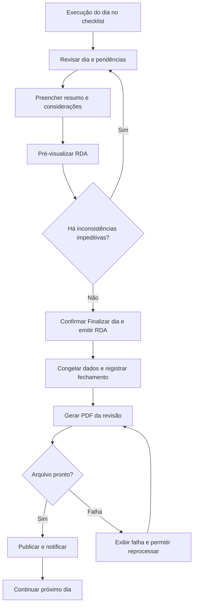

# AUDITA — Planejamento do Relatório Diário de Auditoria

**Produto:** Audita PRO  
**Documento:** plano de evolução do RDA — versão 0.1  
**Data:** 06/10/2026  
**Situação:** proposta para validação; sem execução no aplicativo ou no banco.

## 1. Contexto e objetivo

A **Audita** é a empresa prestadora de serviços. O **Audita PRO** é seu aplicativo para auditorias, documentos/laudos e treinamentos. A operação inicial tem um único profissional, que poderá atuar como Administrador e condutor da auditoria. Clientes e auditores de apoio serão incluídos conforme a necessidade.

O RDA deve permitir que esse profissional registre a auditoria uma única vez, revise o resultado do dia e emita um documento padronizado, rastreável e acessível ao cliente. Não serão criados departamentos, cadeias de aprovação ou um segundo aprovador obrigatório para uma operação que ainda não precisa deles.

Este plano se concentra no **Relatório Diário de Auditoria** e nas dependências indispensáveis do checklist e do cronograma. O planejamento completo do formulário comercial, do plano de auditoria e do checklist poderá ser detalhado com os próximos materiais. Treinamentos e laudos não fazem parte desta entrega proposta.

### Base analisada

- Arquivo enviado: `RELATÓRIO DIÁRIO DE AUDITORIA.txt`, lido integralmente.
- Planejamento anterior de Auditorias v1.1 e documento da entrega atual.
- Código local de geração, revisão, publicação, acesso e apresentação dos documentos e indicadores.

A comparação descreve o código e as migrations locais disponíveis. Não foi realizada nova inspeção do banco remoto nesta etapa. Nenhuma instrução do anexo foi executada como comando; seu conteúdo foi utilizado como requisito para este planejamento.

## 2. Decisões centrais

1. Nome oficial: **AUDITA — RELATÓRIO DIÁRIO DE AUDITORIA (RDA)**.
2. Cada RDA pertence obrigatoriamente a uma organização, uma auditoria e um dia auditado.
3. O condutor revisa antes de finalizar o dia. Sua confirmação é a aprovação necessária para iniciar a emissão.
4. O fechamento congela os dados; o PDF é gerado a partir dessa cópia, sem consultar informações que possam mudar depois.
5. O RDA somente fica **Emitido** quando o PDF daquela revisão estiver pronto e publicado.
6. Todos os usuários autorizados da organização cliente poderão consultar os RDAs emitidos, mesmo sem presença no dia.
7. Presença, direito de consulta e confirmação de ciência são registros distintos.
8. Resultado diário e progresso acumulado aparecem separados.
9. Fotos e documentos entram no PDF por seleção do condutor, com legenda e referência.
10. O RDA não contém decisão de certificação. Essa informação pertence ao relatório final.

## 3. O que será aproveitado e o que muda

| Tema | Base atual | Evolução proposta |
|---|---|---|
| Vínculos | Empresa, auditoria e dia já relacionados | Preservar os identificadores e evidenciar os vínculos no documento |
| Fechamento | Encerra o dia e gera documento para revisão posterior | Revisar e pré-visualizar antes; fechamento confirmado autoriza a emissão |
| Versionamento | Conteúdo congelado e versões já existem | Adicionar identidade RDA, revisão visível e PDF persistente por versão |
| Acesso do cliente | Destinatários ligados à presença diária | Consulta do RDA emitido por vínculo ativo com a organização, independentemente da presença |
| PDF | Gerado no navegador ao solicitar | Gerado automaticamente após fechamento e armazenado de forma privada |
| Progresso | Itens aplicáveis avaliados ÷ itens aplicáveis | Progresso de execução: processados, incluindo N/A justificado, ÷ itens do escopo |
| Conteúdo manual | Campo de complementos | Resumo executivo, pendências e considerações em campos separados |
| Evidências | Texto e anexos privados já disponíveis | Síntese, seleção para publicação, legenda, ordem e referências congeladas |
| Achados | NC e notas de avaliação | OBS e OM estruturadas, distintas do resultado do requisito |
| Cronograma | Plano versionado e movimentações | Situação diária explícita, execução parcial, desvios e continuidade |
| Apresentação | Documento textual com logo Audita PRO | Padrão documental Audita com gráficos, cabeçalho e rodapé em todas as páginas |

Essas mudanças não autorizam reescrever os documentos já emitidos nem ampliar automaticamente a consulta de evidências originais, atas ou relatórios finais.

## 4. Identificação e controle documental

Exemplo ilustrativo: **AUD-2026-0001 / RDA-01 / Rev.00**.

- O código da auditoria existente será preservado; o exemplo não exige recodificar auditorias anteriores.
- `RDA-01` identifica um documento lógico dentro da auditoria. A numeração será atribuída ao primeiro fechamento, sem duplicidade, e permanecerá estável.
- A data auditada e o número do dia são informações separadas do identificador do RDA. Inserir ou corrigir uma data no planejamento não renumera relatórios emitidos.
- A primeira emissão aparece como `Rev.00`; as seguintes, `Rev.01`, `Rev.02` etc. É possível manter a numeração técnica interna já existente, com conversão apenas na apresentação.
- Código de cliente: reutilizar o cadastro existente quando houver. Se faltar, prever um identificador curto e estável, sem torná-lo uma informação a digitar a cada relatório. Não usar CPF como código.
- Data auditada, horário real de execução, horário de fechamento e horário de emissão são campos diferentes.
- Armazenar instantes com referência temporal consistente e apresentá-los no fuso da auditoria. Um registro salvo depois da meia-noite não deve mudar de dia auditado automaticamente.

O controle de cada revisão incluirá autor do fechamento, data/hora, aprovador/condutor, motivo da revisão, versão do plano, versão do modelo documental, regra de indicadores, identificador do PDF e resumo de integridade do arquivo.

## 5. Estrutura oficial do RDA

Adotar a sequência final de 14 seções apresentada no anexo.

| Seção | Conteúdo | Origem e edição |
|---|---|---|
| 1. Identificação da auditoria | Cliente, CNPJ, código do cliente/auditoria/RDA, revisão, data, período, critérios/normas e edições, natureza, tipo, localização, objetivo, escopo, condutor, equipe e presentes | Automática a partir dos registros e da presença efetiva |
| 2. Resumo executivo do dia | Contexto e síntese das atividades | Texto obrigatório do condutor |
| 3. Atividades planejadas × realizadas | Horários, processo/área, atividade, responsável, execução e desvio | Plano de referência + execução; justificativas registradas pelo condutor |
| 4. Indicadores do dia | Contagens, legenda e gráfico dos resultados | Cálculo automático do conjunto diário |
| 5. Progresso acumulado | Processados, pendentes, total do escopo e gráfico | Cálculo congelado no fechamento |
| 6. Requisitos avaliados | Norma/critério, item, processo/local, resultado, síntese da evidência e referência do registro | Checklist; síntese revisável e rastreável |
| 7. Não conformidades | Código, requisito, processo, classificação quando definida e descrição resumida | NCs formalizadas naquele dia |
| 8. Observações | Constatações relevantes que não são NC | Registros OBS do dia |
| 9. Oportunidades de melhoria | Sugestões sem caracterizar descumprimento | Registros OM do dia |
| 10. Evidências selecionadas | Fotos, legendas e referências de documentos | Seleção explícita do condutor |
| 11. Pendências e acompanhamento | Demanda, origem, responsável quando definido, destino/prazo e situação | Itens pendentes + complementação do condutor |
| 12. Alterações em relação ao plano | Previsão anterior, alteração, destino, motivo e autoria | Histórico do cronograma |
| 13. Considerações do condutor | Contexto técnico adicional do dia | Texto ou declaração explícita de ausência |
| 14. Controle documental | Emissão, revisão, responsável e histórico | Automático |

### Campos com significado inequívoco

“Natureza”, “tipo”, “parte” e “modalidade” não devem se tornar campos duplicados com o mesmo significado. Na implementação, mapear o cadastro existente e apresentar separadamente: critério/norma; finalidade, como certificação/manutenção quando pertinente; primeira/segunda/terceira parte; presencial/remota/híbrida. Ajustar os rótulos com os próximos documentos do plano e checklist.

Nome/CNPJ, totais e autoria não serão alterados apenas no texto do PDF. A correção deve ocorrer no cadastro de origem antes do fechamento ou em retificação controlada. Os textos humanos podem ser editados na revisão sem alterar silenciosamente a evidência original.

## 6. Indicadores: definição única

O anexo apresenta duas fórmulas de progresso. Para eliminar a divergência, este plano adota a definição apresentada por último: **progresso de execução inclui N/A processado e justificado**. Essa mudança precisa ser aplicada de maneira coordenada no Dashboard, na auditoria e nos novos RDAs.

### Unidade de contagem

Contar o item do escopo que deve ser avaliado. No modelo atual, a referência principal é requisito + processo. O mesmo requisito em dois processos representa duas unidades; novas fotos ou novas gravações do mesmo item não aumentam o total. Local/unidade só criará uma unidade adicional quando o planejamento realmente definir verificações independentes.

Reavaliação do mesmo item em outro dia pode aparecer no movimento diário, mas não duplica a unidade no acumulado. O histórico anterior permanece registrado.

### Indicadores diários

O conjunto diário reúne os itens previstos para o dia de referência e os itens efetivamente trabalhados nele, incluindo antecipações. Cada unidade aparece uma vez no resumo, com sua situação no fechamento.

Mostrar separadamente:

- Total de itens contemplados no dia.
- Avaliados aplicáveis: conformes + parcialmente conformes + não conformes.
- Processados: avaliados aplicáveis + não aplicáveis justificados.
- Não avaliados: itens diários ainda pendentes, inclusive os transferidos antes da avaliação.
- OBS e OM: contagens de registros próprios, sem entrar na soma dos resultados do checklist.

O exemplo do anexo soma 28 itens: 21 conformes + 3 parciais + 2 não conformes + 1 N/A + 1 não avaliado. Portanto, são **28 itens no conjunto, 27 processados e 26 avaliados aplicáveis**, e não 28 avaliados. O documento usará rótulos que evitem essa confusão.

### Progresso acumulado

`Progresso de execução = (C + PC + NC + N/A justificado) ÷ total de itens do escopo vigente × 100`.

Exemplo: 55 C + 5 PC + 3 NC + 7 N/A + 30 não avaliados = 100 itens → **70% de execução**.

- N/A não fica pendente e continua exigindo justificativa.
- Nenhum item no escopo: “Sem itens definidos”, sem divisão por zero.
- Todos os itens N/A e justificados: 100% processados, com destaque “Nenhum item aplicável”; isso não significa conformidade nem certificação.
- Alterar escopo pode mudar o denominador. Registrar o motivo e a versão do plano, sem recalcular RDAs anteriores.
- Oportunidade de melhoria não será resultado de conformidade. Se houver registros legados nesse estado, sua conversão exigirá análise; não assumir automaticamente que eram conformes.
- Índice de conformidade fica fora do RDA v0.1.

### Gráficos

1. **Resultados do dia:** barras com C, PC, NC e N/A, cores consistentes, números e legenda. O total não avaliado aparece em indicador separado. Barras são a opção inicial por permitirem leitura direta; não é necessário incluir uma segunda visualização com os mesmos dados.
2. **Execução acumulada:** barra proporcional “Processados × Pendentes”, com fração e percentual. Exemplo: “70 de 100 itens processados — 70%”.

Gráficos usarão dados congelados, permanecerão legíveis em impressão monocromática e trarão valores textuais. Não haverá gráfico vazio artificial nem percentuais ilustrativos em documentos reais.

## 7. Cronograma, desvios e trabalho restante

O RDA deve comparar o plano vigente no início do dia, mudanças ocorridas durante o dia e execução real. Comparar apenas com o plano final esconderia transferências já realizadas.

| Situação no RDA | Regra |
|---|---|
| Realizada | Trabalho previsto concluído, independentemente de os resultados serem conformes ou não |
| Realizada parcialmente | Uma parte identificável foi feita; registrar o que foi realizado, o que falta e o encaminhamento |
| Reprogramada | Trabalho não executado naquele dia transferido para outra data/atividade, com motivo |
| Não realizada | Trabalho não executado e ainda sem reagendamento confirmado; exige motivo e pendência de continuidade |

Para uma atividade parcial cujo restante foi transferido, manter “Realizada parcialmente” e mostrar separadamente a reprogramação do restante. Não apagar a parcela realizada para registrar a transferência.

Essas classificações documentais não precisam substituir os estados operacionais de todo o aplicativo. A implementação deve mapear os estados existentes e acrescentar os dados que faltarem.

Será possível encerrar um dia com trabalho pendente **documentado e encaminhado**, sem marcar atividades artificialmente como concluídas. Isso altera o bloqueio atual que exige conclusão ou reagendamento de toda atividade. Encerrar o dia continua diferente de encerrar a auditoria.

Uma pendência transferida conserva identidade, origem e vínculo ao trabalho de destino. Uma nota livre no RDA não altera o cronograma sozinha: o condutor deve confirmar o reagendamento na interface correspondente.

## 8. Checklist, NC, OBS e OM

Cada avaliação deve fornecer ao RDA: requisito e versão do critério, resultado, processo/local, dia auditado, evidência textual/resumida, anexos, autor, data/hora, indicação de amostragem quando houver e vínculos aos achados.

- **NC:** descumprimento do critério, formalizado em registro próprio. Usar a estrutura atual, preservando responsável e prazo já previstos.
- **OBS:** informação relevante sem caracterizar uma NC.
- **OM:** possibilidade de aperfeiçoamento, sem representar automaticamente uma obrigação.

OBS e OM terão identificação, texto, autor, data/hora e vínculo com auditoria/dia e, quando pertinente, requisito/processo. Não transformar toda observação livre já existente em OBS formal sem revisão.

Proposta de códigos sequenciais por auditoria: `NC-001`, `OBS-001`, `OM-001`. Preservar os códigos existentes; uma migração não renomeará achados já publicados. Sequências novas devem resistir a criação simultânea e não reutilizar números cancelados.

A classificação maior/menor só será exigida quando a metodologia escolhida a definir. Não inferir classificação pela quantidade de evidências.

Uma avaliação marcada “Não conforme” exige NC vinculada antes da emissão. A regra atual de permitir apenas justificativa sem NC deverá ser ajustada para novos RDAs. Um resultado “Parcialmente conforme” exige decisão técnica registrada: formalizar NC quando houver descumprimento ou justificar seu tratamento segundo a metodologia adotada. Isso ficará visível na pré-validação.

## 9. Evidências e fotografias

O registro eletrônico conserva as evidências completas. O RDA inclui a síntese necessária e somente os arquivos selecionados.

No checklist, acrescentar **Incluir no RDA**, legenda e ordem. A prévia mostrará exatamente o material que será publicado.

- Fotos selecionadas: incluir imagem legível, legenda, código da evidência e requisito/processo.
- Documentos PDF selecionados: inicialmente apresentar referência, título e síntese; não incorporar automaticamente todas as páginas nem expor o arquivo original sem autorização.
- Contagens separarão anexos fotográficos, arquivos documentais e registros textuais. Não chamar cada arquivo de “documento analisado” sem um registro de análise correspondente.
- Preservar o limite existente de 10 MB por evidência e os formatos PDF/JPEG/PNG. Esse limite não deve ser aplicado indevidamente ao PDF final do relatório.
- Não inserir documentos de identificação ou competência de usuários no RDA.
- A versão emitida preserva o conteúdo publicado, a legenda e a referência do arquivo. Substituir posteriormente uma evidência não pode trocar a imagem de um RDA emitido.
- Selecionar conteúdo para o RDA significa disponibilizá-lo a todos os leitores autorizados desse relatório. O condutor deve revisar a seleção tendo esse público em vista.

## 10. Fluxo de fechamento e emissão

O botão final deve explicar: “Os registros deste dia serão fechados. Correções posteriores exigirão revisão controlada.”

### Verificações antes de confirmar

- Condutor designado autorizado; organização, auditoria e dia consistentes.
- Plano publicado e atividades do dia revisadas.
- Presenças revisadas, sem copiar automaticamente toda a equipe como presente.
- Itens trabalhados com resultado; itens não avaliados identificados como pendência.
- Evidência necessária disponível; N/A justificado.
- NCs formalizadas e tratamento dos parciais definido.
- Desvios com motivo e encaminhamento; alterações preservadas no histórico.
- Resumo executivo preenchido.
- Pendências informadas ou opção explícita “Sem pendências”.
- Considerações preenchidas ou “Sem considerações adicionais”.
- Anexos selecionados disponíveis e prévia atualizada.

Mostrar erros com link direto ao item a corrigir e avisos separados dos bloqueios. Se os dados mudarem depois da prévia, exigir atualização da prévia antes de finalizar.

### Estados

| Estado documental | O que significa | Acesso do cliente |
|---|---|---|
| Em elaboração | Dados/textos em revisão; prévia identificada como rascunho | Não |
| Fechado | Conteúdo aprovado pelo condutor e congelado; PDF em preparação | Não |
| Emitido | PDF daquela revisão pronto e publicado | Sim |

O processamento do PDF possui estado técnico próprio: pendente, processando, concluído ou falhou. “Fechado — falha na geração, tentar novamente” não deve parecer documento emitido.

Duplo clique, atualização da página e tentativa após falha devem retomar a mesma revisão, sem gerar outro RDA, outro fechamento ou notificações duplicadas. Uma falha de PDF não perde os registros nem reabre o dia automaticamente.

Não exigir uma segunda aprovação após o fechamento normal. A revisão técnica já ocorreu antes da confirmação; a geração e publicação são automáticas.

## 11. Revisões e integridade

“Corrigir RDA” abre uma nova revisão, exige motivo e mantém a versão vigente disponível enquanto a nova estiver em elaboração.

- A revisão anterior nunca é sobrescrita.
- Dados coletados em dias posteriores não entram automaticamente numa retificação do dia anterior.
- Se a correção envolver resultado ou evidência de origem, registrar a correção e sua autoria, relacionando-a à nova revisão. Editar apenas um texto no PDF não resolve inconsistência no checklist.
- Ao emitir a nova revisão, marcá-la como vigente e a anterior como substituída, com data e referência cruzada.
- Proposta: leitores autorizados podem abrir versões anteriores pelo histórico, com identificação clara “Versão substituída”. A listagem comum privilegia a vigente.
- Congelar também gráficos, fórmulas utilizadas, códigos, nomes apresentados, presenças, plano de referência e evidências incorporadas.
- Alterações no cadastro da empresa, no nome do usuário ou na identidade visual valem para emissões futuras; não reescrevem PDFs antigos.

Documentos legados permanecerão com a fórmula, nomenclatura e revisão originalmente emitidas. A transição deverá identificar o padrão documental usado em cada versão.

## 12. Consulta e permissões

O item 14 do anexo prevalece, neste planejamento, sobre a menção inicial a “participantes”: **o RDA emitido será consultável por todos os usuários autorizados da organização auditada**, mesmo sem participação no dia.

| Perfil/condição | Rascunho | RDA emitido/PDF | Fechar/emitir/retificar |
|---|---|---|---|
| Condutor designado — Auditor Líder ou Administrador | Sim | Sim | Sim |
| Administrador da Audita | Sim, para gestão | Sim | Somente quando designado condutor; pode reatribuir com histórico |
| Auditor de apoio interno atribuído à auditoria | Não por padrão | Sim | Não |
| Usuário da organização cliente com vínculo autorizado | Não | Sim, da própria organização | Não |
| Usuário de outra organização sem autorização | Não | Não | Não |
| Conta/vínculo inativo | Não | Não | Não |

**Proposta de compatibilidade:** manter a aprovação cadastral/documental já exigida no Audita PRO. “Ativo” não liberará documentos a um usuário cujo cadastro ainda esteja pendente de validação. Essa interpretação fica destacada para validação.

O vínculo empresarial deve ser aprovado pelo Administrador; escolher uma empresa no Meu Perfil não concede consulta automaticamente. Profissionais internos da Audita precisam de atribuição legítima à auditoria, sem criar permissões de administração no cliente apenas para acessar um RDA.

Proposta para usuários incluídos posteriormente: após vínculo aprovado, consultar também os RDAs históricos emitidos da organização. Remover/inativar o vínculo revoga novas consultas; um arquivo já baixado não pode ser recolhido pelo aplicativo.

O novo acesso é exclusivo do RDA e do conteúdo publicado nele. Não concede acesso irrestrito a todas as evidências originais, usuários, resultados internos, atas ou relatórios finais. A Biblioteca deverá permitir abrir o RDA diretamente, mesmo quando a conta não tem acesso ao detalhe operacional da auditoria.

Autorização deve ser conferida no servidor e no download privado. Não usar URL pública permanente. A presença real continuará constando no documento, sem adicionar leitores à lista de participantes.

## 13. Notificações e ciência

Reutilizar o sino e o histórico existentes.

- Publicação: “RDA-01 Rev.00 disponível — [empresa / auditoria / data]”.
- Nova revisão: indicar substituição e motivo resumido apropriado ao destinatário.
- Falha de emissão: avisar o condutor, com ação para reprocessar; não avisar o cliente que o documento está disponível.
- Notificar os leitores elegíveis no momento da publicação, com deduplicação por versão/usuário/evento.
- Usuários vinculados depois recebem acesso à biblioteca, sem uma avalanche automática de avisos antigos.

Consulta, notificação lida e ciência são diferentes. O RDA não dependerá de assinaturas para ser disponibilizado. As tarefas de ciência existentes deverão continuar separadas; eventuais assinaturas do relatório final e GOV não serão implementadas por este plano.

## 14. PDF e identidade visual

Documento A4, com respiro, tabelas legíveis, cabeçalhos repetidos e páginas numeradas. O número de páginas será consequência do conteúdo, sem comprimir excessivamente o texto para caber em um limite arbitrário.

- Cabeçalho em todas as páginas: identidade da **Audita** e “Relatório Diário de Auditoria”.
- Rodapé: Audita, auditoria, RDA, revisão, data auditada e “Página X de Y”.
- Gráficos e imagens com boa resolução; fotos sem distorção; tabelas extensas com títulos repetidos.
- Seções sem registros informam “Nenhuma NC identificada no dia”, “Sem evidências selecionadas” etc.
- Prévia identificada como não emitida; PDF substituído identificado ao acessar o histórico.
- Arquivo sugerido: `[codigo-auditoria]_RDA-01_Rev00_2026-10-06.pdf`.
- Uma mesma revisão sempre baixa o mesmo PDF armazenado. Reprocessar uma falha de geração usa o conteúdo e a versão de layout já fixados.

A logo atualmente fornecida é do **Audita PRO**. Não será criada ou presumida uma logo corporativa da Audita. Até o fornecimento/validação da marca corporativa, propõe-se usar a marca disponível e identificar textualmente “AUDITA — Relatório Diário de Auditoria”.

O pedido de observar normas ABNT pertinentes será tratado como requisito de revisão documental específica antes da implementação do layout. Este plano não declara conformidade com uma norma ABNT ainda não identificada como aplicável ao documento.

## 15. Plano técnico de evolução, sem execução

Reutilizar `daily_reports`, `daily_report_versions`, `audits`, `audit_days`, planos versionados, avaliações, evidências, NCs, vínculos e notificações. Não criar um segundo módulo de relatórios diários.

### Alterações propostas, separadas por responsabilidade

| Bloco | Trabalho previsto |
|---|---|
| Conteúdo editorial | Campos de resumo, considerações, declaração de ausência de pendências, identidade RDA e versão do padrão |
| Execução diária | Classificações documentais das atividades, parcial/restante, origem/destino e dados de amostragem |
| Achados | Representação estruturada de OBS/OM, reutilizando equivalentes se existirem; códigos por auditoria |
| Evidências publicadas | Seleção, legenda, ordem, referência imutável e síntese |
| Cálculo | Serviço comum de indicadores diários/acumulados, com regra versionada e data de corte |
| Fechamento | Pré-validação, controle de concorrência, congelamento e operação idempotente |
| Emissão | Geração automática no servidor, PDF privado, checksum, erro recuperável e publicação |
| Acesso | Consulta do RDA por organização, autorização interna por atribuição e download validado |
| Interface | Assistente de revisão, prévia, histórico, Biblioteca e notificações |

Os nomes definitivos de novos campos/tabelas serão decididos após inspeção do schema durante a implementação. Não criar uma tabela nova quando JSON versionado ou estrutura existente representar adequadamente o dado.

Para a operação inicial, propor um processador de PDF no backend existente, usando o próprio registro de emissão para persistir estado e retomar falhas. Não contratar novo provedor ou adotar uma infraestrutura distribuída apenas para este piloto. A escolha da biblioteca/runtime será verificada com fotos, gráficos e documentos de várias páginas antes da implementação definitiva.

Persistir o fechamento e o pedido de emissão em transação. Gerar/upload do arquivo fora dessa transação, verificar integridade, então publicar com atualização condicional. Emissão concorrente e retentativa não poderão criar duas revisões para o mesmo fechamento. Arquivos incompletos não terão acesso liberado.

A futura alteração de autorização deve ser específica para RDA; modificar indiscriminadamente o helper compartilhado de todos os documentos ampliaria também o acesso a atas/finais. Revisar funções, policies, consultas e Storage em conjunto.

Antes de qualquer migração futura: inventariar dados reais, verificar versões existentes, preparar compatibilidade e testar os consumidores do Dashboard, Biblioteca, notificações e relatório final. Manter as migrations pequenas e documentar a reversão de funcionalidades sem apagar documentos emitidos.

## 16. Etapas de implementação após aprovação

1. **Contrato de dados e regras:** validar este plano, fórmulas, acesso e identidade; inspecionar schema real e definir migrações compatíveis.
2. **Registros de origem:** completar resumo, OBS/OM, síntese/amostragem, evidências selecionadas e encaminhamento das pendências.
3. **Revisão e fechamento:** construir a tela de revisão, prévia com inconsistências, congelamento e revisões controladas.
4. **PDF e emissão:** implementar gráficos, layout, armazenamento por revisão, geração automática e recuperação de falhas.
5. **Distribuição:** aplicar consulta por organização, download protegido, Biblioteca e notificações; integrar nova fórmula nas telas operacionais.
6. **Validação do piloto:** executar auditoria de vários dias, testar correções e isolamento, e disponibilizar para a validação da Audita.

Cada etapa terá entregável verificável. A aprovação deste documento não será tratada como prova de que a funcionalidade já está implementada.

## 17. Critérios de aceite

| ID | Cenário | Resultado esperado |
|---|---|---|
| RDA-01 | Encerrar um dos cinco dias | Criar somente o RDA daquele dia, vinculado a empresa/auditoria/data |
| RDA-02 | Pré-visualizar antes do fechamento | Conteúdo completo com gráficos, seleção de fotos e indicação de rascunho |
| RDA-03 | Outra sessão alterar dados após a prévia | Impedir fechamento silencioso e pedir atualização da revisão |
| RDA-04 | Exemplo 55 C, 5 PC, 3 NC, 7 N/A e 30 pendentes | Exibir 70% processados; distinguir dia e acumulado |
| RDA-05 | Mesmo item salvo várias vezes | Não multiplicar contagens; preservar autoria/histórico |
| RDA-06 | Mesmo requisito em dois processos | Contar as unidades previstas separadamente |
| RDA-07 | Escopo vazio ou totalmente N/A | Não dividir por zero nem apresentar falsa conformidade |
| RDA-08 | Atividade parcial e transferência repetida | Preservar execução, previsão anterior, motivos e trabalho restante |
| RDA-09 | Item não conforme sem NC | Bloquear emissão e apontar o item a formalizar |
| RDA-10 | Selecionar duas de doze fotos | Publicar apenas duas, com legenda/referência e boa legibilidade |
| RDA-11 | Correção no dia seguinte | Rev.00 e seu PDF permanecem iguais; correção controlada gera Rev.01 |
| RDA-12 | Falha de PDF ou duplo clique | Preservar fechamento, permitir retomada e não duplicar documento/aviso |
| RDA-13 | Gestor ativo autorizado sem presença | Consultar RDA emitido da própria organização |
| RDA-14 | Conta pendente, inativa ou de outro cliente | Recusar consulta e download por API e URL |
| RDA-15 | Novo leitor na organização | Consultar histórico emitido sem aparecer como participante dos dias |
| RDA-16 | Publicar revisão substituta | Biblioteca abre vigente; histórico identifica anterior; avisos sem duplicidade |
| RDA-17 | RDA com várias páginas | Cabeçalho, rodapé, numeração, gráficos e tabelas legíveis em todas |
| RDA-18 | Auditoria ainda em andamento | RDA não informa decisão de certificação nem gera relatório final |
| RDA-19 | Aplicar mudança de autorização | Não ampliar acesso a evidências originais, atas ou finais por acidente |
| RDA-20 | Abrir documento legado | Preservar sua fórmula, conteúdo e arquivo originais |
| RDA-21 | Um único profissional Administrador/condutor | Concluir o fluxo sem precisar criar aprovador fictício |

## 18. Pontos destacados para sua validação

As necessidades estão suficientemente descritas para planejar. Recomenda-se confirmar estas escolhas junto com o documento:

1. **Progresso principal inclui N/A justificado**, conforme a última fórmula do anexo; relatórios antigos preservam sua fórmula original.
2. **Consulta por organização mantém aprovação cadastral** e inclui documentos anteriores para novos vínculos aprovados; presença deixa de ser requisito de leitura do RDA.
3. **Uma confirmação do condutor antes de fechar autoriza a emissão**, sem segunda aprovação obrigatória depois.
4. **Revisões anteriores ficam consultáveis com identificação de substituídas**, enquanto a Biblioteca prioriza a vigente.
5. **Identidade da Audita:** usar provisoriamente a marca disponível com identificação textual da empresa, até validar a logo corporativa.

**Resultado desta etapa:** planejamento salvo para revisão. Nenhuma tela, migration, policy, arquivo do aplicativo ou dado operacional foi alterado.
